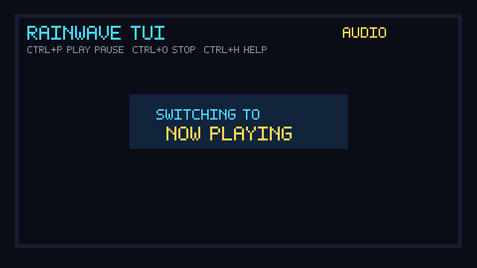

# Rainwave TUI

A flashy terminal user interface for Rainwave radio stations.



## Current Status

This repo currently contains a working Rust/Ratatui prototype with live Rainwave API parsing, external-player playback, Ctrl-based commands, keyring-backed credential storage, a demo GIF, and regression tests for the API shapes that previously broke startup.

## Recent Changes

- Added screen-switch transition overlays and animated now-playing music glyphs.
- Added a clear audio status meter in the bottom status bar.
- Added album-art metadata parsing from Rainwave `songs[].albums[].art`, HTTP image fetching, and terminal color-block rendering in Now Playing.
- Fixed search input so `Ctrl+K`, typing, and `Enter` populate in-app results.
- Added elapsed/remaining progress text plus a progress bar.
- Split playback into play/pause/resume and stop.
- Converted commands to Ctrl-based keybindings.
- Made `Esc` close help/input overlays.
- Hardened JSON parsing against Rainwave's real response shapes, alternate field names, and explicit `null` values.
- Added keyring-backed API-key storage so secrets are not written to config JSON.
- Added `Rainwave-TUI.md` as the synchronized design document.

## Features

- 🎵 **Now Playing** - Shows current song, artist, album, and progress
- 🖼️ **Album Art Panel** - Pulls Rainwave album art and renders it with terminal color blocks
- ✨ **Animations** - Screen-switch transition overlays, animated music glyphs, and an audio activity meter
- 📻 **Station Selection** - Browse and switch between Rainwave stations
- 🗳️ **Voting** - Vote for songs in elections
- 📋 **Request Queue** - Manage your song requests
- 🔍 **Search** - Search for songs, albums, and artists
- 💿 **Album Browsing** - Browse albums and their songs
- 🔐 **Login Support** - Login to access all features
- ▶️ **Playback** - Audio playback via mpv/mplayer/ffplay
- ⭐ **Rating** - Rate songs (1.0-5.0)
- 💖 **Favorites** - Favorite/unfavorite songs

## Installation

```bash
git clone <repo-url>
cd Rainwave-TUI
cargo build --release
```

## Usage

Run the TUI:
```bash
cargo run
```

## Keybindings

### Navigation
- `Tab` - Switch between views
- `↑/↓` - Navigate lists
- `Enter` - Select item / Vote / Request song

### Actions
- `Ctrl+V` - Vote for selected song in election
- `Ctrl+T` - Rate current song (opens rating input)
- `Ctrl+F` - Favorite/unfavorite current song
- `Ctrl+R` - Add current song to request queue
- `Ctrl+D` - Delete selected request

### Playback
- `Ctrl+P` - Play/Pause/Resume
- `Ctrl+O` - Stop playback
- `Ctrl+B` - Browse stations

### Other
- `Ctrl+L` - Login/Logout
- `Ctrl+K` - Search
- `Ctrl+H` - Toggle help
- `Esc` - Close help/input
- `Ctrl+Q` - Quit

## Requirements

- Rust (for building)
- One of: mpv, mplayer, or ffplay (for audio playback)
- Terminal with color support

## Configuration

Passwords are never stored. Rainwave API keys are stored in the operating system keyring. `~/.config/rainwave-tui/config.json` only stores non-secret metadata such as username, user ID, and station ID.

Older configs containing a plaintext `api_key` are migrated into the keyring and rewritten without the secret on next load/save. Logout removes the keyring entry.

## Verification

```bash
cargo test
cargo build
```

## Known Notes

- Playback requires `mpv`, `mplayer`, or `ffplay` on `PATH`.
- Pause/resume uses process signals for the external player.
- Album art is fetched over HTTP and rendered using RGB terminal color blocks. If art cannot be fetched, the panel falls back to album name and art URL.
- Login flow stores only the Rainwave API key returned by login, and stores it in the OS keyring.

## Colors & Styling

The TUI uses colors to indicate different elements:
- 🔵 Cyan - Now Playing, Search
- 🟡 Yellow - Elections, User info
- 🟢 Green - Requests, Albums
- 🔴 Magenta - Progress bars
- 🔵 Blue - Stations
- 🟣 Purple - Login screen
